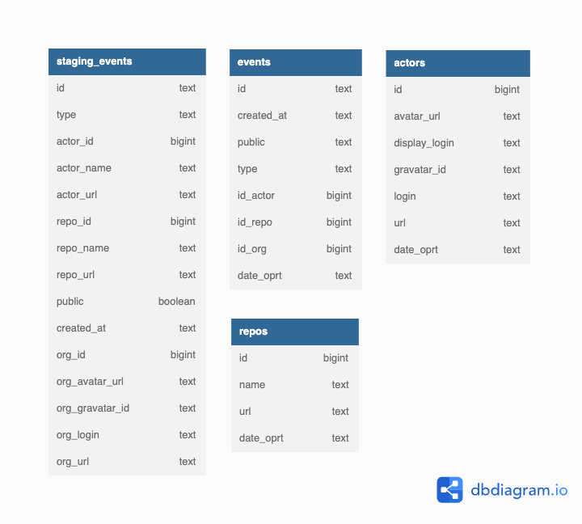
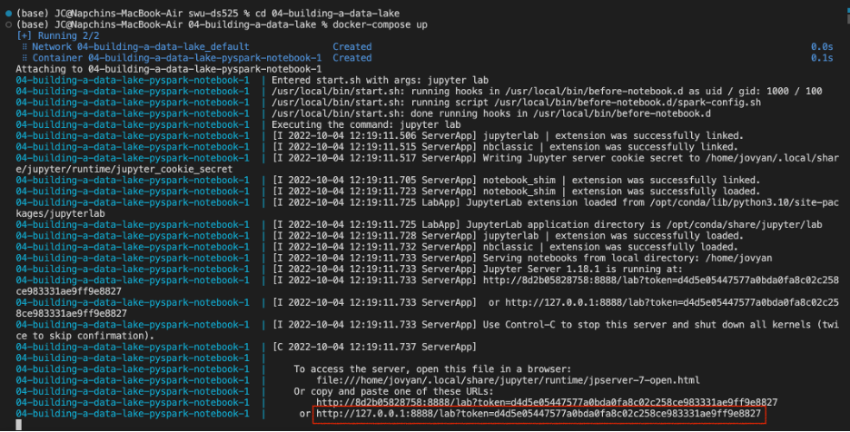
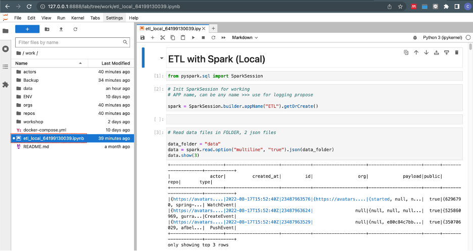

# Building a Data Warehouse

## Data model

<br>

## Documentation
[Documentation](https://github.com/chin-lertvipada/swu-ds525/blob/f488152fb40274e07f5a9baf0ebedd523fbaa8ec/03-building-a-data-warehouse/Doc/Week%203%20-%20Building%20dwh%20-%20Summary.pdf)
<br>
__________
<br>

## Project implementation instruction
<br>


### 1. change directory to project 04-building-a-data-lake:
```sh
$ cd 04-building-a-data-lake
```

### 2. prepare environment workspace by Docker:
```sh
$ docker-compose up
```

### 3. Open JupyterLab URL:
<br>


<br>

### 4. Execute the Notebook 'etl_local_64199130039.ipynb' step by step: 
<br>


<br>

### 5. Chcek the cleaned output data in folders, partition by 'date_oprt':
#### actors
<br>

#### repos
<br>

#### orgs
<br>

#### events
<br>


## Shutdown steps

### 11. Shutdown environment workspace:
```sh
$ docker-compose down
```
