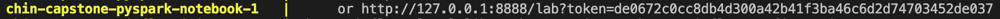
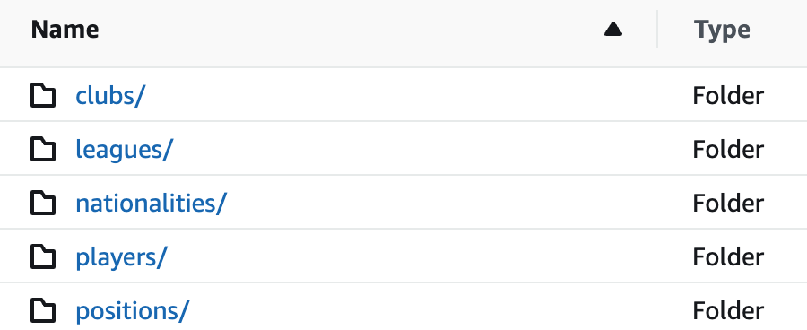
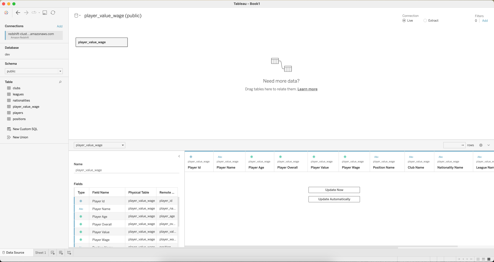

# Capstone Project - Chin Lertvipada 64199130039

## Data model (Datalake)

<br>

## Data model (Datawarehouse)

<br>
__________
<br>

## Project Information Documentation
[Information Documentation](https://github.com/chin-lertvipada/swu-ds525/blob/b19f682d79c748e7f674b3a47c82b4dc80f9f9c5/chin-capstone/document/Capstone%20-%20Summary.pdf)
<br>
__________
<br>

## Project Overview Presentation
[Presentation Documentation](https://github.com/chin-lertvipada/swu-ds525/blob/4e44777ae66f79edc1d15d498d4558e11dc0f619/chin-capstone/document/Capstone%20-%20Presentation.pdf)

[](https://youtu.be/7uj3f0Q5t0I)
<br>
__________
<br>

## Project implementation instruction
<br>

### 1. Change directory to project **"chin-capstone"**:
```sh
$ cd chin-capstone
```
<br>

### 2. Prepare Cloud access (AWS):
- Retrieve credential thru AWS terminal
```sh
$ cat ~/.aws/credentials
```


- Copy 3 following values to update the source codes<br>

*Values to copy:*
> - aws_access_key_id
> - aws_secret_access_key
> - aws_session_token

*Source code to update (1):*
> - /code/etl_datalake_s3.ipynb


*Source code to update (2):*
> - /dags/etl_dwh_airflow.py


<br>

### 3. Prepare Datalake storage (AWS S3):
- Create below S3 bucket with *"All public access"*
> - **jaochin-dataset-fifa**


- Create below repositories in the bucket
> - **landing** (store raw data)<br>
> - **cleaned** (store datalake or cleaned data)


- Place the raw data in **"landing/"**


<br>

### 4. Prepare Datawarehouse storage (AWS RedShift):
- Create Redshift cluster with following information


- Copy "**Endpoint**" and Cluster information to update Redshift credential


- Update the source code with Redshift credential
> - **dags/etl_dwh_airflow.py**


<br>

### 5. Create virtual environment named **"ENV"** (only 1st time):
```sh
$ python -m venv ENV
```
<br>

### 6. Activate the visual environment:
```sh
$ source ENV/bin/activate
```
<br>

### 7. Install needful libraries from configuration file (only 1st time):
```sh
$ pip install -r prerequisite/requirements.txt
```
<br>

### 8. Prepare environment workspace thru Docker:
- If Linux system, run 2 following commands (for Airflow usage)

```sh
mkdir -p ./dags ./logs ./plugins
```
```sh
echo -e "AIRFLOW_UID=$(id -u)" > .env
```

- After that, run below command to start Docker

```sh
docker-compose up
```
<br>

### 9. Execute the **"Datalake"** process thru Web service:
- Access PySpark Notebook UI by port 8888 (localhost:8888)



- Run PySpark Notebook **"/code/etl_datalake_s3.ipynb"**


- The cleaned data will be stored in S3 for each entity
> - jaochin-dataset-fifa/cleaned/clubs/<br>
> - jaochin-dataset-fifa/cleaned/leagues/<br>
> - jaochin-dataset-fifa/cleaned/nationalities/<br>
> - jaochin-dataset-fifa/cleaned/players/<br>
> - jaochin-dataset-fifa/cleaned/positions/<br>




- Each entity is partitioned by **"date_oprt"** (execution date)


<br><br>

### 10. Execute the **"Datawarehouse"** process thru Airflow:
- Access Airflow UI by port 8080 (localhost:8080) with below credential
> - Username: "airflow"<br>
> - Password: "airflow"<br>

- The Datawarehouse script will be run follow the schedule configuration
> - Schedule: "Monthly" (1st of each month)<br>
> - Start date: "1st December 2022"


- The Datawarehouse data will be loaded into Redshift (check by Query editor)
```sh
select * from player_value_wage;
```


<br>

### 11. Dashboard creation thru Tableau:
- Connect Tableau Desktop to Redshift by following information


- Load the data from Redshift to Tableau



- Create Dashboard to visualize the insight!

https://public.tableau.com/app/profile/chin.lertvipada/viz/Capstone_csv/FootballMarketValue

<br>
__________
<br>

## Shutdown steps
##### 1. Stop services by shutdown Docker:
```sh
$ docker-compose down
```

##### 2. Deactivate the virtual environment:
```sh
$ deactivate
```